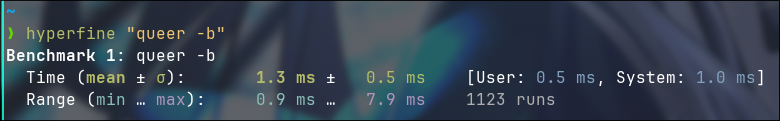

# queer
Queer is a little CLI tool to print pride flag in your terminal.

## Installation
### Prerequisites
- Go (with GOBIN env configured)

### Installation
To install the CLI tool, you have just to execute this command:
```sh
go install github.com/oriionn/queer
```

## Available flags
- Lesbian
- Gay
- Bisexual
- Transgender
- Pansexual
- Asexual
- NonBinary
- Aromantic
- Polysexual
- Demiboy
- Demigirl
- Agender
- Bigender
- Genderfluid
- Neutrois
- Trigender
- Femboy
- Men loving Men

## Benchmark
Here is a little benchmark made with [Hyperfine](https://github.com/sharkdp/hyperfine)
```
Benchmark 1: queer -b
  Time (mean ± σ):       1.3 ms ±   0.5 ms    [User: 0.5 ms, System: 1.0 ms]
  Range (min … max):     0.9 ms …   7.9 ms    1123 runs
```

<details>
    <summary>Screenshot as a proof</summary>
    
</details>

## License
This project is under the [MIT License](LICENSE). More info on [Choose a license](https://choosealicense.com/licenses/mit/).
